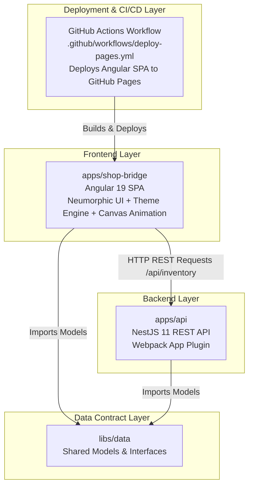

# ShopBridge System Architecture

This document provides a technical overview of the architecture, design patterns, data flow, directory structure, UI animation/theme engine, and GitHub Pages deployment workflow of the **ShopBridge** workspace.

---

## 1. High-Level Architecture Overview

ShopBridge is built as an **Nx Monorepo** containing a full-stack e-commerce inventory management system. It separates concerns between the web frontend, backend microservice, shared data contract libraries, and automated CI/CD deployment pipelines.



---

## 2. Directory Structure & Workspace Layout

```
shopbridge-nx/
├── .github/
│   └── workflows/
│       └── deploy-pages.yml    # GitHub Actions Workflow for Automated GitHub Pages Deployment
│
├── apps/
│   ├── api/                    # NestJS 11 Backend Application
│   │   ├── src/
│   │   │   ├── app/            # App Module, Controller, Service
│   │   │   └── main.ts         # Server Bootstrapper (Port 3333, Global Prefix 'api')
│   │   ├── webpack.config.js   # NxAppWebpackPlugin Configuration (Nx 20 Standard)
│   │   └── project.json        # Nx Project Configuration
│   │
│   ├── shop-bridge/            # Angular 19 Frontend Application
│   │   ├── src/
│   │   │   ├── app/
│   │   │   │   ├── core/       # Core Angular Services & Shell Components
│   │   │   │   ├── data/       # Data Access Services (HttpClient + localStorage Fallback)
│   │   │   │   ├── layout/     # Neumorphic Shell, Header, Footer & Canvas Animation
│   │   │   │   ├── shared/     # Reusable UI components (Page Loader)
│   │   │   │   └── modules/    # Feature Modules (Landing, List, Add, Edit, Delete)
│   │   │   └── styles.scss     # Neumorphic SCSS Design System & Dual-Theme Variables
│   │   ├── proxy.conf.json     # Dev Server Proxy (/api -> http://localhost:3333)
│   │   └── project.json        # Nx Project Configuration
│   │
│   └── shop-bridge-e2e/        # Cypress 13 End-to-End Test Suite
│       └── src/integration/    # Automated user workflow tests
│
├── libs/
│   └── data/                   # Shared TypeScript Library (@thinkbridge/data)
│       └── src/lib/            # Inventory Data Models & Interfaces
│
├── docs/                       # Project Architecture & API Specifications
├── .gitignore                  # Git Ignore Rules (Excludes .nx and .angular caches)
├── nx.json                     # Nx Monorepo Configuration
├── package-lock.json           # Tracked dependency lockfile
├── package.json                # Project Dependencies & Scripts
└── tsconfig.base.json          # TypeScript Compiler & Path Mappings (@thinkbridge/data)
```

---

## 3. UI Design System, Theme Engine & Animation Physics

### A. Soft Neumorphic Tactile Design Pattern

The frontend uses a **Soft Neumorphic & Tactile UI Pattern** with a centered spatial layout:

- **Extruded Card Surfaces (`.neu-card`, `.neu-card-sm`)**: Dual-shadow 3D soft cards providing physical depth.
- **Recessed Inset Inputs (`.neu-input`)**: Inset soft inner shadows for form inputs and status badges.
- **Tactile Push Buttons (`.neu-btn`, `.neu-btn-primary`, `.neu-btn-emerald`, `.neu-btn-rose`)**: Interactive buttons with physical push states (`active:scale-95`).

### B. Dual-Theme Engine (Light / Dark Mode Switcher)

- **Dark Mode (Default)**: Deep graphite background (`#0f1319`), dark dual shadows (`#0a0d12` / `#242a36`), light primary text.
- **Light Mode**: Warm soft slate background (`#e0e6f0`), light dual shadows (`#babecc` / `#ffffff`), dark primary text.
- **State Persistence**: Theme choice is persisted in `localStorage` under `shopbridge_theme` and applied via `.dark` / `.light` root classes.

### C. Interactive Mouse-Tracking Background Animation

- `WrapperComponent` embeds a fixed background HTML5 canvas overlay (`#bgCanvas`).
- **Cursor Spotlight Glow**: Smooth radial gradient spotlight follows mouse position across empty space (`window:mousemove`).
- **Reactive Particle Constellations**: Floating ambient particles drift dynamically and form subtle constellation connecting lines when the mouse pointer moves nearby.

---

## 4. GitHub Pages & Static Host Integration

1. **Automated CI/CD Workflow**: [.github/workflows/deploy-pages.yml](file:///.github/workflows/deploy-pages.yml) triggers on every push to `main`, building the Angular application with `--base-href=/shopbridge-nx/`.
2. **SPA Routing Fallback**: Generates `404.html` (copy of `index.html`) so direct navigation to sub-routes (`/list`, `/add`, `/edit/:id`) works seamlessly without 404 static hosting errors.
3. **Data Access Fallback**: In static hosting mode where the NestJS API server is offline, [DataService](file:///apps/shop-bridge/src/app/data/services/data.service.ts) catches HTTP errors and gracefully falls back to `localStorage` state, allowing visitors to test live CRUD operations on the GitHub Pages demo site.
